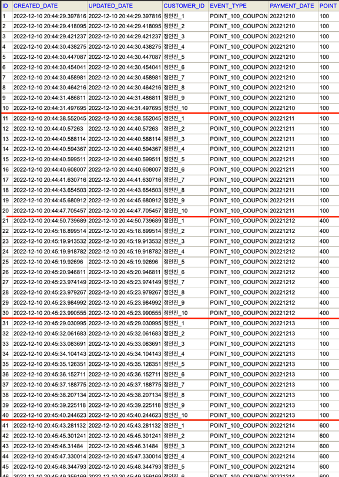
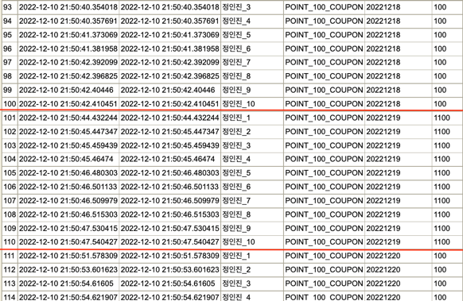
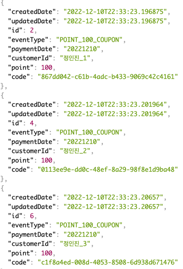
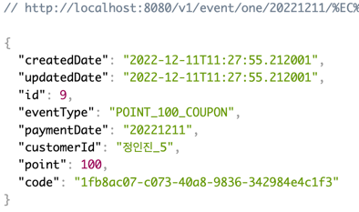

#프로젝트: firstComeFirstServed(선착순 이벤트)
```text
SpringBoot version: 2.6.2
SDK: openjdk(17.0.1)

Language: Java(11)
Type: Gradle - Kotlin

Dependencies:
- Spring Web: 2.6.2
- Spring Data Redis: 2.7.6
- Lombok: 1.18.24
  Packaging: Jar

Test: JUnit5, tdd 적용
- 스케줄러 작동 테스트
- redis util 의 작동 테스트(정렬, 중복, 등)
- 서비스 테스트

사양 : 애플 m1 14인치
```
---
조건:
**의 민족 치킨데이 처럼 사람이 몰릴 수 있는 환경을 생각하여 작업하였습니다.  
redis sort set 을 이용하여 처리하였습니다.  
테스트코드로 인하여, 중복 등 확인 완료.  
아이디어 참고페이지:  
https://www.youtube.com/watch?v=MTSn93rNPPE: [우아한테크토크] 선착순 이벤트 서버 생존기! 47만 RPM에서 살아남다?!  
구글링: redis sort set(여러 기타 자료)  
스프링부트 스케줄링(https://data-make.tistory.com/699 등)
---

작동: 
1. 고객이 대기열에 등록  
2. 스케줄러가 ms 단위(설정) 에 따라 설정 갯수만큼 가져와 쿠폰지급

테스트방법: 기존 인터넷 또는 postman 또는 cli 창으로 http 호출(get 방식)
1. url: http://localhost:8080/v1/event/coupon 호출
   - 아이디나 그 외 pk 키로 회원을 정의
   - 아이디는 UUID 로 대체
   - 서버 실행 후 10번 호출 후 쿠폰 발행종료 확인
2. 10개의 쿠폰 지급후 다음날로 자동 세팅 추가하였음 (ex:20221212 일의 쿠폰만료 -> 20221213 으로 세팅)
3. url: http://localhost:8080/v1/event/coupon 호출 하여 다음날 데이터 확인

- 기타: 레디스 데이터를 모두 초기화 하고 싶을경우 url: http://localhost:8080/v1/event/init 호출 후 다시 10번 호출
---
- h2 
  - 테이블
    - CONSECUTIVE_DATES: 고객별 연속 일자 입력 데이터
    - COUPON_PAYMENT: 쿠폰 지급 내역
- h2 query (참고용)
- SELECT * FROM CONSECUTIVE_DATES;
- SELECT * FROM COUPON_PAYMENT;
---
#설치 
  - 레디스 설치: mac 기준
  - 참고: https://redis.io/docs/getting-started/installation/install-redis-on-mac-os/ 또는 https://zero-gravity.tistory.com/328
  1. brew --version 확인 (미설치시 brew 설치)
  2. brew install redis
  3. 끝  
 - 정상 작동 확인 =>
   1. cli(terminal) 여시고 명령어 입력 및 레디스 확인방법
      - 명령어(기본):
      1. 서버 시작: redis-server => 경고 나오면 "허용" 선택
      2. 서버 확인: redis-cli ping => 응답 결과: PONG
      3. 서버 정지: redis-cli shutdown
 - 기타: redis ui 툴로 확인(설정: localhost:6379)
 - h2 설치
   - 참고페이지: https://so-easy-coding.tistory.com/5 
   - 설치후: h2 설치 후 해당 사용자/h2/bin 폴더 이동 -> 커맨드 ./h2.sh
   - h2 접속 : jdbc:h2:./mms
   - 정상접속시 => mss.mv.db 생성(application.yml 참고)
  ---
  리눅스 실행:
   - 실행
       - 빌드: ./gradlew build (h2, redis 전부 구동중이여야함.)
       - 정상빌드 후 build/libs 이동
       - 서버구동: java -jar firstComeEvent-0.0.1-SNAPSHOT.jar
   - 테스트: ./gradlew test

---
- 아래는 데이터 스크린샷
  - n명의 고객의 n번의 날짜로 정삭등록
    - datalist01.png
  - 10일 이후 다시 1일로 포인트 초기화
  - 
  - 리스트 조회 json
    - 
  - 단건 조회 json
    - 